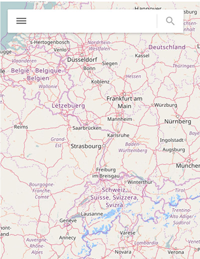
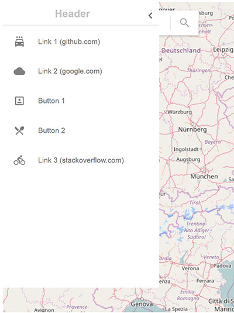

# leaflet-searchbox   
A google map style search box which includes a side panel slider control.

depends on https://github.com/smeijer/leaflet-geosearch
	
## Demo

http://leaflet-searchbox.bungos.me/

## Snapshots
<div style="max-width:600px;display:flex;flex-direction:row;justify-content: space-between;">


</div>

## Code Example
``` js
const L = require('leaflet');
import 'leaflet/dist/leaflet.css'
import 'leaflet-geosearch/assets/css/leaflet.css';
import SearchBox from 'leaflet-searchbox'
import 'leaflet-searchbox/dist/style.css'

function button2_click() {
    console.log('button 2 clicked !!!');
}

var map = L.map('map').setView([51.505, -0.09], 5);
map.zoomControl.setPosition('topright');
map.addLayer(new L.TileLayer('http://{s}.tile.openstreetmap.org/{z}/{x}/{y}.png',
    { attribution: 'Map data <a href="http://openstreetmap.org">OpenStreetMap</a> contributors' }
));
var control = new SearchBox({
    // remove these if dont need sidebar
    sidebarTitleText: 'Header',
    sidebarMenuItems: {
        Items: [
            { type: "link", name: "Link 1 (github.com)", href: "http://github.com", icon: "icon-local-carwash" },
            { type: "link", name: "Link 2 (google.com)", href: "http://google.com", icon: "icon-cloudy" },
            { type: "button", name: "Button 1", onclick: "alert('button 1 clicked !')", icon: "icon-potrait" },
            { type: "button", name: "Button 2", onclick: "button2_click();", icon: "icon-local-dining" },
            { type: "link", name: "Link 3 (stackoverflow.com)", href: 'http://stackoverflow.com', icon: "icon-bike" },

        ]
    }
});

map.addControl(control);
map.on('geosearch/showlocation', x => {
    console.log(x)
    L.marker(x.location.latlng, {
        icon: new L.Icon({
            iconUrl: marker,
            iconRetinaUrl: marker2x,
            shadowUrl,
            className: "geosearch-location"
        }), draggable: false
    }).addTo(map);
})
```
## Options

| Option                   | Type     | Default        | Description |
| ------------------------ | -------- | -------------- | -------------------------------------- |
|    provider  |  Provider  |  OpenStreetMapProvider  |  provider from leaflet-geosearch  |
|resultItemClickCallback|callback|resultItemClickCallback| default panTo to location fire 'geosearch/showlocation' event and hide search result. `context:SearchBox`|
|suggest|callback|suggest| provide suggest when query location`context:SearchBox` |
|resultItemTemplate|string|see source| result item template use lodash.template |
## Acknowledgments

leaflet-searchbox was inspired by [leaflet-custom-searchbox](https://github.com/8to5Developer/leaflet-custom-searchbox)

Some thing I did

* fix some styles
* with leaflet-geosearch's osm provider supports searching 
* make it more modernize and modularize